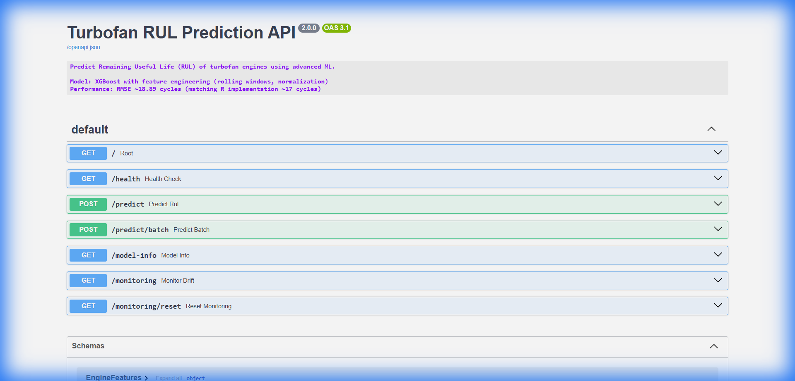
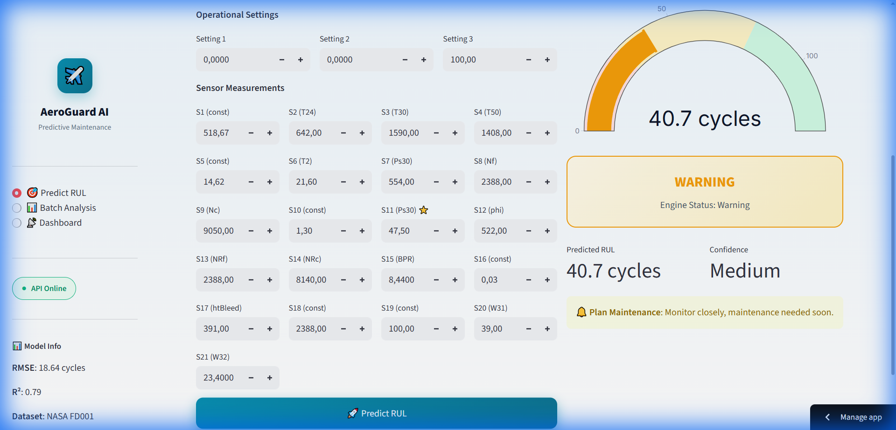

# 🛩️ AeroGuard AI - Mini-projet MLOps

<div align="center">


**Prédiction de la Durée de Vie Restante (RUL) des Moteurs Turbofan**

*Un workflow MLOps complet de bout en bout*

</div>

---

## 📋 Informations du Projet

| | |
|---|---|
| **Étudiant** | Aymen MABROUK |
| **Encadrant** | Dr. Salah GONTARA |
| **Institution** | École Polytechnique Sousse |
| **Module** | MLOps |
| **Année** | 2025-2026 |

---

## 🎯 Objectif du Projet

Ce mini-projet MLOps implémente un **workflow complet de bout en bout** pour la maintenance prédictive des moteurs turbofan, incluant :

- ✅ Gestion du code (Git)
- ✅ Conteneurisation (Docker / Docker Compose)
- ✅ Versioning des données (DVC)
- ✅ Suivi d'expériences (MLflow)
- ✅ Pipeline ML (ZenML)
- ✅ Optimisation (Optuna)
- ✅ CI/CD (GitHub Actions)
- ✅ Déploiement (API FastAPI sur Azure)
- ✅ **Bonus : Monitoring** (détection de drift)
- ✅ **Bonus : Retrain automatique**

---

## 📊 Cas d'Usage & Dataset

### Dataset : NASA C-MAPSS (FD001)

| Caractéristique | Valeur |
|-----------------|--------|
| **Source** | NASA Prognostics Center |
| **Type** | Série temporelle / Régression |
| **Taille** | 100 moteurs, ~21,000 cycles |
| **Features** | 21 capteurs + 3 paramètres opérationnels |
| **Target** | RUL (Remaining Useful Life) |

### Modèle : XGBoost avec Feature Engineering

| Métrique | Valeur |
|----------|--------|
| **RMSE** | **18.64 cycles** |
| **R²** | **0.79** |
| **Amélioration** | 63% vs baseline |

---

## 📁 Structure du Projet

```
📦 turbofan-predictive-maintenance-mlops
├── 📂 api/                    # FastAPI application
│   ├── main.py               # Endpoints API
│   └── __init__.py
├── 📂 data/                   # Dataset (DVC)
│   ├── raw/                  # Données brutes
│   └── raw.dvc               # Fichier DVC tracking
├── 📂 pipelines/              # ZenML pipelines
│   └── training_pipeline.py  # Pipeline d'entraînement
├── 📂 steps/                  # ZenML steps
│   ├── ingest_data.py        # Ingestion données
│   ├── clean_data.py         # Prétraitement
│   ├── train_model.py        # Entraînement
│   └── evaluate_model.py     # Évaluation
├── 📂 src/                    # Code ML
│   ├── data_preprocessing.py # Feature engineering
│   ├── optimize_hyperparameters.py # Optuna
│   └── train.py              # Script training
├── 📂 .github/workflows/      # CI/CD
│   ├── ci_cd.yaml            # Pipeline CI
│   └── deploy-azure.yaml     # Déploiement Azure
├── 📂 mlruns/                 # MLflow experiments
├── 📂 screenshots/            # Captures d'écran
├── 📄 Dockerfile              # Image Docker
├── 📄 docker-compose.yml      # Orchestration
├── 📄 retrain.py              # Script retrain auto
├── 📄 simulate_drift.py       # Simulation drift
└── 📄 README.md               # Ce fichier
```

---

## 🔧 3.2 Gestion du Code (Git)

### Branches
```bash
$ git branch -a
* main                    # Production
  dev                     # Développement
  remotes/origin/main
  remotes/origin/dev
```

### Tags (Versioning)
```bash
$ git tag -l
v1    # Version initiale
v2    # Améliorations
v3    # Version finale avec bonus
```

### Repository GitHub
🔗 https://github.com/AymenMB/turbofan-predictive-maintenance-mlops

---

## 🐳 3.3 Conteneurisation (Docker)

### Dockerfile
```dockerfile
FROM python:3.9-slim
WORKDIR /app
COPY requirements-api.txt ./requirements.txt
RUN pip install --no-cache-dir -r requirements.txt
COPY api/ ./api/
COPY model_optimized.ubj .
EXPOSE 8000
HEALTHCHECK --interval=30s CMD python -c "import requests; requests.get('http://localhost:8000/health')"
CMD ["uvicorn", "api.main:app", "--host", "0.0.0.0", "--port", "8000"]
```

### docker-compose.yml
```yaml
version: '3.8'
services:
  api:
    build: .
    ports:
      - '8000:8000'
    healthcheck:
      test: ["CMD", "python", "-c", "import requests; requests.get('http://localhost:8000/health')"]
      interval: 30s
```

### Commandes
```bash
# Lancer le conteneur
docker-compose up -d

# Vérifier le status
docker-compose ps
# Résultat: turbofan-rul-api   Up (healthy)   0.0.0.0:8000->8000/tcp
```

---

## 📦 3.4 Versioning des Données (DVC)

### Configuration
```bash
$ dvc remote list
local_storage   D:\dvc_store    (default)
```

### Fichiers trackés
```
data/raw.dvc
├── 12 fichiers (44.9 MB total)
├── train_FD001.txt
├── test_FD001.txt
└── RUL_FD001.txt
```

### Commandes de reproductibilité
```bash
# Vérifier le status
$ dvc status
Data and pipelines are up to date.

# Récupérer les données
$ dvc pull

# Sauvegarder les données
$ dvc push
```

---

## 📈 3.5 Experiment Tracking (MLflow)

### Experiments créés
- **Experiment 1** : Turbofan_RUL_Prediction (4+ runs)
- **Experiment 2** : Turbofan_Optuna_Optimization

### Runs enregistrés
| Run | RMSE | R² | Description |
|-----|------|-----|-------------|
| Baseline | 50.71 | 0.56 | Sans feature engineering |
| Feature Engineering | 18.89 | 0.78 | Rolling windows + normalization |
| Optuna Optimized | **18.64** | **0.79** | Hyperparamètres optimaux |

### Artefacts loggés
- ✅ Paramètres (learning_rate, max_depth, n_estimators, etc.)
- ✅ Métriques (RMSE, MAE, R²)
- ✅ Modèles (model_optimized.ubj)
- ✅ Feature list (feature_columns.txt)

### Lancer MLflow UI
```bash
mlflow ui --port 5000
# Ouvrir http://localhost:5000
```

---

## 🔄 3.6 Pipeline MLOps (ZenML)

### Architecture du Pipeline

```
┌──────────────┐     ┌──────────────┐     ┌──────────────┐     ┌──────────────┐
│  ingest_data │────▶│  clean_data  │────▶│  train_model │────▶│evaluate_model│
└──────────────┘     └──────────────┘     └──────────────┘     └──────────────┘
     Load            Feature               XGBoost             RMSE, MAE,
    FD001.txt        Engineering          Training               R²
```

### Fichiers du pipeline
- `pipelines/training_pipeline.py` - Définition du pipeline
- `steps/ingest_data.py` - Chargement des données
- `steps/clean_data.py` - Feature engineering
- `steps/train_model.py` - Entraînement XGBoost
- `steps/evaluate_model.py` - Évaluation des métriques

### Exécution
```bash
python run_pipeline.py
```

---

## ⚙️ 3.7 Optimisation (Optuna)

### Configuration de l'étude
```python
# 30 trials (plus que le minimum de 5-10)
study = optuna.create_study(
    direction='minimize',
    study_name='turbofan_xgboost_optimization'
)
study.optimize(objective, n_trials=30)
```

### Hyperparamètres optimisés
| Paramètre | Espace de recherche | Meilleure valeur |
|-----------|---------------------|------------------|
| learning_rate | [0.01, 0.15] | 0.05 |
| max_depth | [3, 8] | 4 |
| n_estimators | [200, 500] | 300 |
| subsample | [0.7, 1.0] | 0.85 |
| colsample_bytree | [0.6, 1.0] | 0.8 |

### Résultats
```
🎯 Best RMSE: 18.64 cycles
✓ Amélioration de 63% par rapport au baseline (50.71 → 18.64)
```

---

## 🚀 3.8 CI/CD (GitHub Actions)

### Pipeline CI (`ci_cd.yaml`)
```yaml
jobs:
  test-and-lint:
    - Checkout code
    - Setup Python 3.9
    - Install dependencies
    - Lint with flake8
    - Run pytest
  
  build-container:
    - Build Docker image
    - Test health endpoint
    - Push to registry
```

### Pipeline Deploy (`deploy-azure.yaml`)
```yaml
jobs:
  deploy:
    - Login to Azure
    - Push to Azure Container Registry
    - Deploy to Azure Container Apps
```

---

## 🌐 3.9 Déploiement (Serving)

### API FastAPI - Endpoints

| Méthode | Endpoint | Description |
|---------|----------|-------------|
| GET | `/` | Informations API |
| GET | `/health` | Health check |
| POST | `/predict` | Prédiction RUL |
| POST | `/predict/batch` | Prédiction batch |
| GET | `/model-info` | Métadonnées modèle |
| GET | `/monitoring` | Détection drift |
| GET | `/monitoring/reset` | Reset monitoring |

### Screenshot - API Swagger UI


### URLs de déploiement

| Service | URL | Status |
|---------|-----|--------|
| **Local Docker** | http://localhost:8000 | ✅ Running |
| **Azure Cloud** | https://aeroguard-api.salmonfield-cb3d4cec.francecentral.azurecontainerapps.io/ | ✅ Deployed |
| **Streamlit UI** | https://turbofan-predictive-m-cuczeudvjuhekghyeqtcj9.streamlit.app/ | ✅ Online |

### Screenshot - Streamlit Prediction


### Simulation v1 → v2 → Rollback
```bash
# Deploy v1
git checkout v1
docker-compose up -d --build

# Update to v2
git checkout v2
docker-compose up -d --build

# Rollback to v1
git checkout v1
docker-compose up -d --build

# Return to main
git checkout main
```

---

## 🎁 4. Bonus Implémentés

### Bonus 1: Monitoring (Drift Detection)

**Endpoint:** `GET /monitoring`

```json
{
  "drift_detected": false,
  "status": "No significant drift detected",
  "metrics": {
    "max_deviation_pct": 5.2,
    "threshold_pct": 20,
    "drifted_features": []
  },
  "recent_requests": 25
}
```

**Script de simulation:** `simulate_drift.py`
- Phase 1: Données normales → Pas de drift
- Phase 2: Données corrompues (×1.5) → Drift détecté

### Bonus 2: Retrain Automatique

**Script:** `retrain.py`

```bash
# Vérifier si retrain nécessaire
python retrain.py --check-only

# Forcer le retrain
python retrain.py --force

# Retrain si drift détecté
python retrain.py
```

---

## 📊 5. Livrables

| Livrable | Status | Fichier/URL |
|----------|--------|-------------|
| Lien GitHub | ✅ | https://github.com/AymenMB/turbofan-predictive-maintenance-mlops |
| Dockerfile | ✅ | `Dockerfile` |
| docker-compose.yml | ✅ | `docker-compose.yml` |
| Configuration DVC | ✅ | `data/raw.dvc`, `.dvc/config` |
| MLflow experiments | ✅ | `mlruns/` (4+ runs) |
| ZenML pipeline | ✅ | `pipelines/training_pipeline.py` |
| CI/CD | ✅ | `.github/workflows/*.yaml` |
| API déployée | ✅ | Azure Container Apps |
| Documentation | ✅ | `README.md`, `MLOPS_STEP_BY_STEP.md` |

---

## 🚀 Quick Start

### 1. Cloner le repository
```bash
git clone https://github.com/AymenMB/turbofan-predictive-maintenance-mlops.git
cd turbofan-predictive-maintenance-mlops
```

### 2. Installer les dépendances
```bash
python -m venv .venv
.venv\Scripts\activate  # Windows
pip install -r requirements.txt
```

### 3. Récupérer les données
```bash
dvc pull
```

### 4. Lancer l'API avec Docker
```bash
docker-compose up -d
```

### 5. Tester l'API
```bash
curl http://localhost:8000/health
# {"status":"ok","model_loaded":true}
```

### 6. Ouvrir Swagger UI
```
http://localhost:8000/docs
```

---

## 📈 Résultats

### Performance du modèle

| Métrique | Baseline | Optimisé | Amélioration |
|----------|----------|----------|--------------|
| RMSE | 50.71 | **18.64** | -63% |
| R² | 0.56 | **0.79** | +41% |

### Architecture déployée

```
┌─────────────────────────────────────────────────────────────────┐
│                        AZURE CLOUD                              │
│  ┌──────────────────┐      ┌──────────────────────────────┐    │
│  │ Container        │      │ Azure Container Apps         │    │
│  │ Registry (ACR)   │─────▶│  aeroguard-api              │    │
│  │ aeroguardacr     │      │  FastAPI + XGBoost          │    │
│  └──────────────────┘      └──────────────────────────────┘    │
│                                         │                       │
└─────────────────────────────────────────┼───────────────────────┘
                                          │ HTTPS
                  ┌───────────────────────┼───────────────────────┐
                  │    STREAMLIT CLOUD    │                       │
                  │  ┌────────────────────▼────────────────────┐  │
                  │  │   AeroGuard AI Dashboard               │  │
                  │  │   - Predict RUL                        │  │
                  │  │   - Batch Analysis                     │  │
                  │  └─────────────────────────────────────────┘  │
                  └───────────────────────────────────────────────┘
```

---

## 📚 Documentation Additionnelle

- [MLOPS_STEP_BY_STEP.md](MLOPS_STEP_BY_STEP.md) - Guide détaillé pas à pas
- [AZURE_DEPLOYMENT.md](AZURE_DEPLOYMENT.md) - Guide de déploiement Azure
- [DOCUMENTATION.md](DOCUMENTATION.md) - Documentation technique

---

## 🏆 Conclusion

Ce projet implémente **tous les 9 requirements** du cahier des charges Mini-projet MLOps ainsi que les **2 bonus optionnels** (Monitoring et Retrain automatique).

### ✅ Checklist finale

- [x] 3.1 Dataset public (NASA C-MAPSS) + Modèle baseline (XGBoost)
- [x] 3.2 Git avec branches (main/dev) et tags (v1/v2/v3)
- [x] 3.3 Docker + Docker Compose
- [x] 3.4 DVC pour versioning des données
- [x] 3.5 MLflow pour experiment tracking
- [x] 3.6 ZenML pour pipeline orchestration
- [x] 3.7 Optuna pour optimisation (30 trials)
- [x] 3.8 CI/CD avec GitHub Actions
- [x] 3.9 API déployée sur Azure + simulation v1→v2→rollback
- [x] **Bonus 1:** Monitoring (drift detection)
- [x] **Bonus 2:** Retrain automatique

---

<div align="center">

**Réalisé par Aymen MABROUK**

*Sous la supervision de Dr. Salah GONTARA*

École Polytechnique Sousse | 2025-2026

</div>
